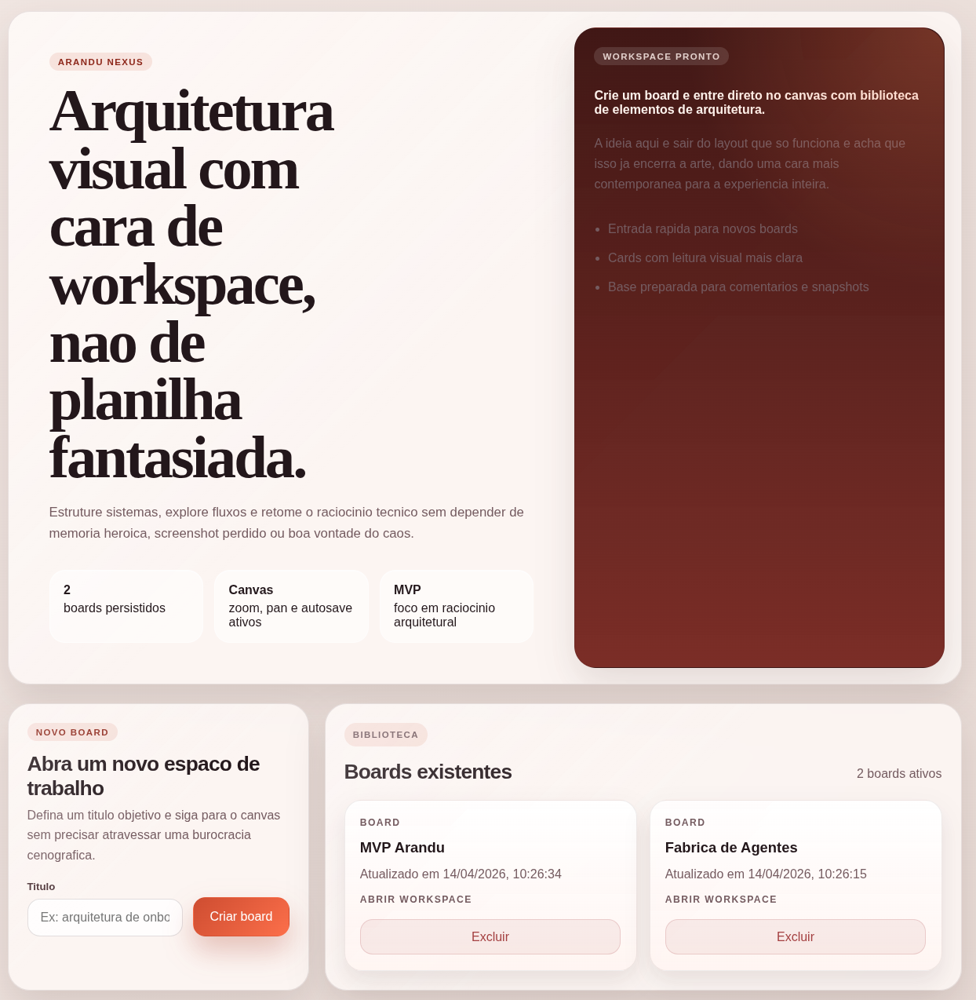
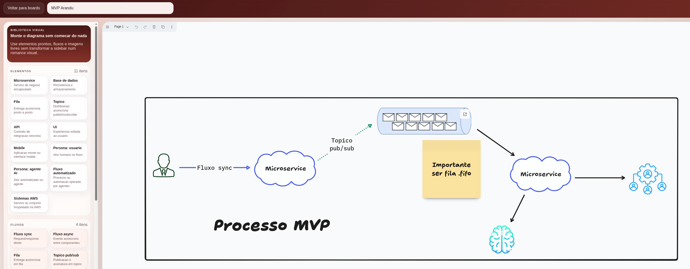

# Arandu Nexus

Arandu Nexus e um workspace visual para raciocinio arquitetural. A proposta do MVP é simples: sair da planilha com glamour acidental e colocar a discussão tecnica num canvas persistido, com fluidez de quadro branco e contexto suficiente para retomar o trabalho depois.

## O que o MVP entrega

- Criacao e listagem de boards persistidos em MongoDB
- Entrada direta no canvas após criar um board
- Canvas livre com zoom, pan e autosave do documento atual
- Biblioteca lateral com elementos, fluxos e imagens para diagramacão
- Mindmap estrutural com topico central, filhos, irmãos e reorganizacao
- Colapso e expansão de ramos com controles contextuais no proprio nó
- Edicao do titulo do board com persistência
- Feedback visual de carregamento para criar, abrir e voltar entre telas

## Como a experiencia aparece hoje

O produto abre com uma area de boards que funciona como biblioteca e ponto de entrada do workspace. Dali, o usuário cria um board, entra no canvas e segue montando o diagrama sem começar do zero. Dentro do board, pode diagramar livremente, iniciar um mindmap pela biblioteca de elementos e expandir a arvore direto pelos controles contextuais dos nós.

## Por que Arandu?

O nome `Arandu` foi escolhido por sua matriz indigena e pela carga de sentido que ele traz. Em diferentes referências ligadas ao guarani e ao universo tupi-guarani, o termo aparece associado a idéias como `sabedoria`, `conhecimento` e `entendimento`. Como acontece com muitos termos de origem indigena atravessados por tradições orais, contextos regionais e registros distintos, a formulação exata pode variar entre as fontes. Ainda assim, o campo semantico recorrente e bastante consistente: aprender, compreender, saber.

Essa idéia conversa diretamente com a proposta do produto. O Arandu Nexus nao foi pensado como um quadro branco qualquer nem como mais uma ferramenta para produzir caixas bonitas e setas obedientes. A ambição aqui e apoiar raciocinio arquitetural de forma visual, permitir que idéias técnicas ganhem estrutura e reduzir a dependencia de memória improvisada, contexto perdido e interpretações heróicas depois da reunião. O nome faz sentido justamente porque o produto nasce para ajudar conhecimento a ser construido, organizado e retomado.

Também existe uma escolha de postura nessa nomeação. Em vez de adotar um nome genérico com verniz futurista, o projeto assume uma referência linguistica e cultural enraizada no territorio, reconhecendo que tecnologia nao precisa se apresentar sempre com sotaque importado para parecer seria. `Arandu`, nesse contexto, funciona quase como uma declaração de intenção: conhecimento com contexto, entendimento com forma e raciocinio com memória.

## Stack do MVP

- Next.js 15
- React 19
- TypeScript
- MongoDB
- tldraw
- Vitest
- ESLint

## Rodando localmente

O caminho recomendado para testar o MVP e usar o Dev Container ja configurado no repositorio. O ambiente sobe a aplicacao e o MongoDB com a configuração esperada para desenvolvimento local.

O passo a passo completo esta em [documentacao/get-started.md](documentacao/get-started.md).

## Comandos uteis

### npm

- `npm install`
- `npm run dev`
- `npm run build`
- `npm run lint`
- `npm run test`

### make

- `make install`
- `make dev`
- `make lint`
- `make test`
- `make build`
- `make check`

## Contexto do projeto

O contexto oficial do MVP, escopo atual e proximas etapas estao centralizados em [documentacao/project-context.md](documentacao/project-context.md). Neste momento, o MVP considerado entregue vai ate a `V3`, com `V4` e `V5` mantidas como próximas etapas possíveis fora do escopo atual.
